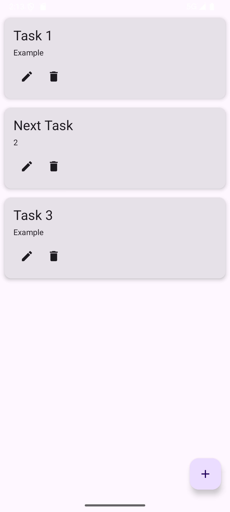
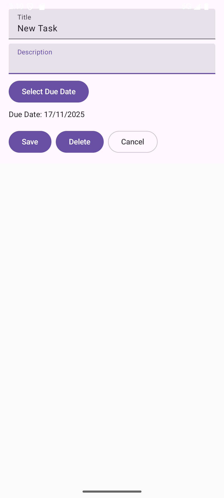
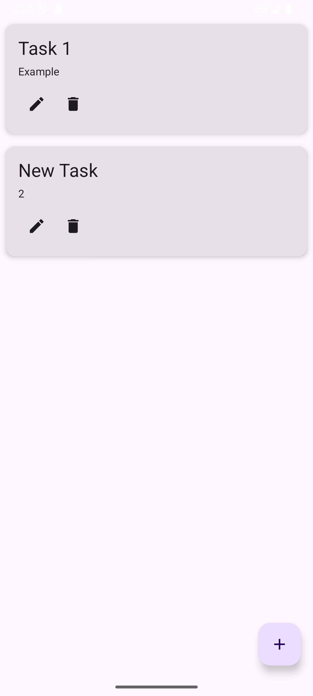

# Task Manager App
Offline task manager built with Kotlin, Jetpack Compose, Room, and MVVM. Add, edit, delete tasks persistently without a backend.
### Roadmap
- Backend API integration
- Authentication
- AI-powered task suggestions
  
## How to run
 1. Clone the repo:  bash  git clone https://github.com/your-username/smart-task-mobile.git
 2. Open in Android Studio (Giraffe or newer) with Kotlin plugin enabled.
 3. Run on an emulator or device (Android 8.0+).

## Features
 - Offline persistence with Room
 - Add, edit, delete tasks
 - Compose UI with Material 3
 - MVVM architecture (ViewModel + Repository)
 - Navigation between list and detail screens
 - Date picker for due dates

## Screenshots
# Task list:

# Add task:

# Edit task:

# Delete task:

